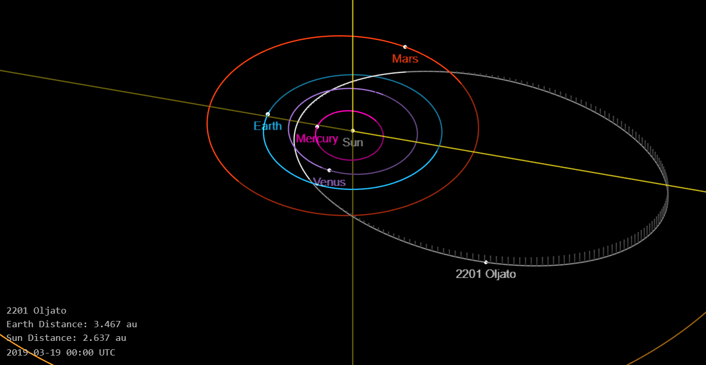

# IFE-Dust-Source

## Overview of Theory
IFEs were first discovered within the Venusian orbit and were believed to be generated by charged dust mass-loading interplanetary magnetic fields, originally the asteroid 2201 Oljato (Russell 1987). However, the dust source hypothesis for IFEs remains a controversial stance. This program will attempt to correlate IFEs measured near-Earth in the solar wind to small bodies which could be a source of dust.

A strong candidate dust source will be a small body that has an orbit inclination close to the XY plane (GSE) of the spacecraft and be the region around the time the IFEs were found (i.e. have a small phase difference) for multiple orbits. Because of the large gyroradius of the charged dust, the cloud will travel approximately radially from the source.

We will first identify possible dust sources for each event and then compare subsequent periods of the small bodies identified to find the percentage of the time IFEs are again seen (see below).

We will consider a small phase difference as anything less than 20 degrees approaching and retreating. We will consider the orbital inclination to be close from an average radial size of IFEs in the XY plane (GSE).

## Dust Theory
Dust is produced via numerous collisions with asteroids and comets, which gets photoionized rapidly. Charged particles mass-load the incident magnetic field, create a pile-up (increasing |B|). The resulting bend of the magnetic field around the obstacle generates a force that accelerates the dust cloud away from the sun. This disturbance is seen as an IFE.

## Overview of Code

neo_asteroid_features.csv will contain all the information for each asteroid (diameter, inclination, etc.) 

**NASA API Details**

"[NeoWs (Near Earth Object Web Service)](https://api.nasa.gov/api.html#NeoWS
"NASA NeoWS API") is a RESTful web service for near earth Asteroid information. With NeoWs a user can: search for Asteroids based on their closest approach date to Earth, lookup a specific Asteroid with its NASA JPL small body id, as well as browse the overall data-set.

Data-set: All the data is from the [NASA JPL Asteroid team](http://neo.jpl.nasa.gov/ "Neo JPL Full Dataset in Online Format")"

**Run Code**

`
python pre_processing.py -A DEMO_KEY
`

Parameters: -A [(API_KEY)](https://api.nasa.gov/index.html#apply-for-an-api-key "Get NASA API Key, but a test run works with 'DEMO_KEY'")
