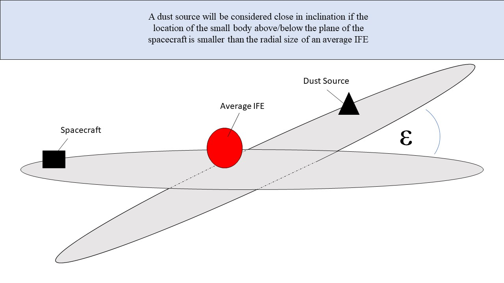
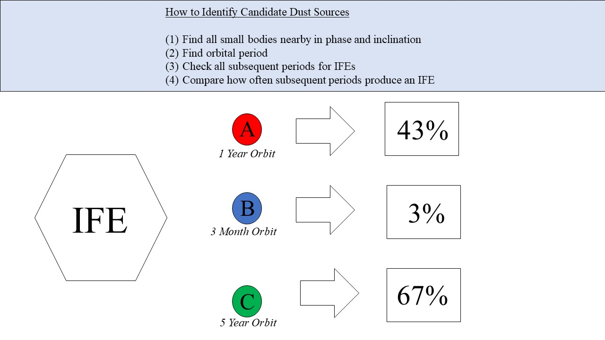
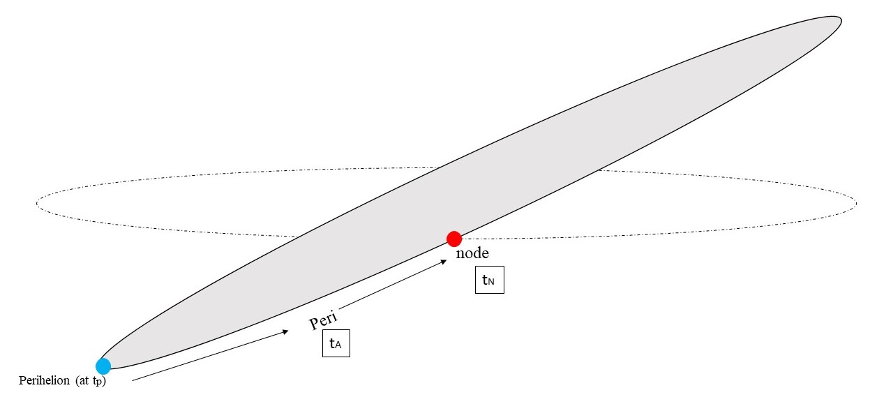

# IFE-Dust-Source

## Overview of Theory
IFEs were first discovered within the Venusian orbit and were believed to be generated by charged dust mass-loading interplanetary magnetic fields, originally the asteroid 2201 Oljato (Russell 1987). However, the dust source hypothesis for IFEs remains a controversial stance. This program will attempt to correlate IFEs measured near-Earth in the solar wind to small bodies which could be a source of dust.

A strong candidate dust source will be a small body that has an orbit inclination close to the XY plane (GSE) of the spacecraft and be the region around the time the IFEs were found (i.e. have a small phase difference) for multiple orbits. Because of the large gyroradius of the charged dust, the cloud will travel approximately radially from the source.

We will first identify possible dust sources for each event and then compare subsequent periods of the small bodies identified to find the percentage of the time IFEs are again seen (see below). Note the periods that can be tested will be constrained by the on the orbital inclination of the body.

We will consider a small phase difference as anything less than 20 degrees approaching and retreating. We will consider the orbital inclination to be close from an average radial size of IFEs in the XY plane (GSE).

Subsequent statistically analysis will be performed through the entire orbit of promising dust source candidates on how the frequency of IFEs changes at different points in the body's orbit (see Russell 1987).

## Dust Theory
Dust is produced via numerous collisions with asteroids and comets, which gets photoionized rapidly. Charged particles mass-load the incident magnetic field, create a pile-up (increasing |B|). The resulting bend of the magnetic field around the obstacle generates a force that accelerates the dust cloud away from the sun. This disturbance is seen as an IFE.

## Overview of Code

neo_asteroid_features.csv will contain all the information for each asteroid (diameter, inclination, etc.) 

**NASA API Details**

"[NeoWs (Near Earth Object Web Service)](https://api.nasa.gov/api.html#NeoWS
"NASA NeoWS API") is a RESTful web service for near earth Asteroid information. With NeoWs a user can: search for Asteroids based on their closest approach date to Earth, lookup a specific Asteroid with its NASA JPL small body id, as well as browse the overall data-set.

Data-set: All the data is from the [NASA JPL Asteroid team](http://neo.jpl.nasa.gov/ "Neo JPL Full Dataset in Online Format")"

**Definitions of Variables**
* e = eccentricity (no unit) describes how close the orbit is to a perfect circle (0 = circle, 0-1 = elliptical orbit, 1 = parabolic escape, >1 = hyperbola)
* a = semi-major axis (Au) describes the long axis of the ellipitical orbit
* q = perihelion distance (Au) describes the point in the orbit closest to the sun
* i = inclination (degree) describes the angle with respect to the xy ecliptic plane
* node = longitude of the ascending node (degree) describes the angle in the xy ecliptic plane from a reference longitude around the sun to the point in the orbit where the body rises through the ecliptic
* peri = argument of perihelion (degree) describes the angle between the orbiting body's closest approach to Earth and its ascending node
* M = mean anomaly (deg) describes the fraction of an elliptical orbit's period elapsed since passing the closest approach
* tp =  (TDB: Barycentric Dynamical Time) describes the time when the orbiting body last passed its closest approach
* period = sidereal orbit period (day & year) describes the time for one orbit
* n = mean motion (deg/day) describes the reciprocal of the period
* Q = aphelion distance (Au) describes the point furthest from the sun in its orbit

**Simplifying Assumptions**
1. The radius of all IFEs is assumed to be the average radial size of IFEs
2. The velocity of the orbit is truncated as to e4 factor
3. The angular velocity is averaged as $\omega$ = $\frac{v}{a}$ 

**Orbital Timing**
We are concerned with the time the orbiting body spends above/below the xy ecliptic plane. To find this we need to find the time it takes for the body to travel from perihelion (crosses at tp) to the ascending node (tA). The time when the body is above the ecliptic plane but within the radius of the IFE is given by tN.

From the simplifying assumptions:

1. tA = (peri)(a)/v
2. tN = ra/vsin(i)
3. v = (2\Pia)/T(1 - e2/4 - (3/64)e4

**Run Code**

`
python pre_processing.py -A DEMO_KEY
`

Parameters: -A [(API_KEY)](https://api.nasa.gov/index.html#apply-for-an-api-key "Get NASA API Key, but a test run works with 'DEMO_KEY'")
